# 🧭 Project Mandala

**90 days from a 40-line `while` loop to a multi-agent support system that a human still approves.**

Agent foundations → OpenAI Agents SDK → CrewAI → LangChain 1.x → LangGraph 1.x → MCP → multi-agent,
one committed day at a time, on a **$0 budget**.

| | |
|---|---|
| **The plan** | [`docs/00_MASTER_PLAN_AGENT_STACKS.md`](docs/00_MASTER_PLAN_AGENT_STACKS.md) — 90 days, 15 phases, 138 IDs |
| **The doc standard** | [Part 11 — the depth contract](docs/00_MASTER_PLAN_AGENT_STACKS.md#part-11--the-depth-contract-doc-architecture-v200) — one document per subtopic |
| **Amendments** | [`docs/CHANGELOG_PLAN.md`](docs/CHANGELOG_PLAN.md) — currently **v2.0.0** |
| **The day map** | [`docs/CURRICULUM_INDEX.md`](docs/CURRICULUM_INDEX.md) — every day, its IDs, its gate |
| **Progress** | [`docs/TRACKER.md`](docs/TRACKER.md) — auto-generated, never hand-edited |
| **The pins** | [`docs/PINS.md`](docs/PINS.md) — versions verified live, 2026-08-20 |
| **The budget** | [`docs/RATE_BUDGET.md`](docs/RATE_BUDGET.md) — free-tier limits, because rate limits *are* the budget |
| **Start here** | [`days/day-00-setup/LESSON.md`](days/day-00-setup/LESSON.md) |

---

## The one-sentence thesis

The four frameworks are four answers to the same question — **"who owns the loop?"**

- **OpenAI Agents SDK:** the model owns the loop; you add tools, guardrails, handoffs.
- **CrewAI:** roles own the loop; you describe a team and it self-organizes (Crews), or you wire
  events (Flows).
- **LangChain:** the abstraction owns the loop; one `create_agent` API over any model or tool.
- **LangGraph:** *you* own the loop; every step is an explicit node in a durable graph.

Everything in 90 days hangs off that sentence. In an interview, answer framework questions by
placing them on that axis.

## The arc

```mermaid
flowchart LR
    A["Phase 0–1<br/>Foundry ·<br/>agents from first principles"] --> B["Phases 2–3<br/>OpenAI Agents SDK<br/>core → advanced"]
    B --> C["Phases 4–5<br/>CrewAI<br/>Crews → Flows"]
    C --> D["Phases 6–7<br/>LangChain 1.x<br/>LangGraph 1.x"]
    D --> E["Phase 8<br/>MCP<br/>the neutral boundary"]
    E --> F["Phase 9<br/>🥇 the bake-off<br/>same slice, four ways"]
    F --> G["Phases 10–11<br/>safety · security<br/>evals · observability"]
    G --> H["Phases 12–14<br/>🏁 Capstone + deploy<br/>+ portfolio"]

    style F fill:#8957e5,color:#fff
    style H fill:#1f6feb,color:#fff
```



**Capstone: Project Mandala** — a multi-agent support-operations system:
**Intake → Triage → Research → Resolve → Report**, with a human approval gate before any external
write.

## Getting started

```bash
git clone <your fork> mandala && cd mandala
# then follow days/day-00-setup/LESSON.md — it installs uv and Python 3.12
```

Once set up, the whole loop is six commands:

```bash
./m status         # how far along am I
./m start 4        # open today's hub, and list its sub-topic documents
./m scaffold 4     # create days/day-04/lab/
./m depth 4        # does day 4 satisfy the depth contract?
./m check          # ruff + ruff format + offline pytest + the depth contract
./m done 4         # refuses to commit until the checklist is ticked and checks are green
```

`./m done` regenerates `docs/TRACKER.md` automatically, so progress can never drift from reality.

## How a day is written

Every day is a folder — a short **hub** plus one document per **subtopic**, never one long page:

```
days/day-04/
├── LESSON.md                     # the hub: the story, the map, setup, the build brief, the eval
├── parts/                        # one folder per section, one document per subtopic
│   ├── 01/
│   │   ├── 1.1-what-structured-output-actually-is.md
│   │   └── 1.2-why-the-schema-lives-in-your-code.md
│   └── 02/
│       └── 2.1-the-context-window-as-a-budget.md
└── CHECKLIST.md                  # ./m done 4 refuses to commit until this is ticked
```

The number is `<section>.<subtopic>`: the section groups subtopics that share one mental model
(usually one curriculum ID), and the hub's §2 map says what each section means.

Every part carries the same ten sections, and they trace one path — from a reader who has never
heard of the idea to one who could defend it in a design review: one-line answer → **the story**
(a scene, no jargon) → the idea in plain language → why Mandala needs it → the mechanism → **line by
line** → when it breaks (the real error text) → **in production** (what changes under load, what a
senior reviewer says, what an interviewer probes) → check yourself. `./m depth N` fails the day if
any is missing.

Two things you will not find in these documents: a time estimate, and an idea that stops at the toy
example. A day is a unit of subject, not of time — it takes as many sittings as it takes, and
nothing is trimmed to fit. The full standard is [Part 11 of the
plan](docs/00_MASTER_PLAN_AGENT_STACKS.md#part-11--the-depth-contract-doc-architecture-v200);
[`days/README.md`](days/README.md) is the reader's version.

## The seventeen rules this repo runs on

The full list is Part 1 of the plan. The seven that shape every file:

1. **Build daily.** Reading without a commit is not a completed day.
2. **From scratch before framework.** A 40-line `while` loop before the Agents SDK. A JSON session
   file before `SQLiteSession`. Cosine similarity before a vector store.
4. **Pin everything.** Exact `==` versions, a committed lockfile, `model=` typed out on every agent.
   Nothing floats — a silent default-model change is how evals break overnight.
5. **Zero budget.** $0, no card on file, ever. The currency is **rate limits**, not dollars.
7. **Evals before features.** A behaviour is not done until a test can go red when it regresses.
15. **Depth over density.** One idea, one document. A wall of text is not depth — it is depth's
    disguise.
16. **A day is a unit of subject, not of time.** No lesson carries a time estimate or a pace, and
    nothing is ever trimmed to fit a schedule.
17. **Assume no prior knowledge, finish at production.** Every subtopic starts from zero and ends
    with how the idea is used in a real system — what breaks at scale, what a senior reviewer says.

## Zero budget, seriously

No card on file anywhere, for 90 days. Free tiers only:

| Need | What we use |
|---|---|
| Daily workhorse | Gemini free Flash-class line — `GEMINI_API_KEY` |
| Fast tool-calling loops | Groq open models on LPU hardware — `GROQ_API_KEY` |
| Diversity, judges, second opinions | OpenRouter `:free` roster — `OPENROUTER_API_KEY` |
| Offline fallback | local Ollama — no key, no limits, lower quality |
| Embeddings | local `sentence-transformers` — no API at all |
| Sandboxing | local Docker — never a paid hosted sandbox |
| Tracing | LangSmith free Developer tier — watch the monthly trace quota |
| CI | GitHub Actions free minutes — **every model call in CI is mocked** |
| Deployment | local Docker Compose + a local load balancer |

The budget is therefore **requests per day, not dollars**, and you cannot top that up at 11pm. Every
lab declares its request budget up front, every model call goes through one 429-aware fallback
router, and `docs/RATE_BUDGET.md` holds the live limits.

Where the plan marks something 🅿️ paid-only — hosted tools, the native harness and sandbox, managed
deployment — it is taught as a concept **and** paired with a free replacement lab you actually build.

## Stack currency

Versions were verified against the live ecosystem on **2026-08-12**, and re-verified on
**2026-08-20** (`docs/03_MASTER_PLAN_ADDENDUM_FRESHNESS_2026-08-20.md`). Two of them move fast
enough to change what gets taught:

- **MCP 2026-07-28** — the spec went **stateless**: no `initialize`, no session pinning,
  `Mcp-Method`/`Mcp-Name` headers, an extensions framework, and Roots/Sampling/Logging deprecated.
  Phase 8 teaches the current revision and includes a deprecation-recognition drill.
- **The OpenRouter `:free` roster** — every `:free` model id is perishable and the roster rotates
  without notice. The fallback router treats them as best-effort by design.

Day 1's entire job is to re-verify every pin and freeze whatever *today* says.

## Writing the days that aren't written yet

`docs/TRACKER.md` shows exactly which days exist. To produce the next one:

```
/day 12
```

That skill lives at [`.claude/skills/day/SKILL.md`](.claude/skills/day/SKILL.md). It plans the split
first, writes one `parts/` document per subtopic, then assembles the hub — and ends by running
`./m depth N`, which is what stops a thin day from being called written.

Days written under plan v1.1.0 (the old single-file format) are archived under
[`legacy/days/`](legacy/README.md) and are being rewritten from Day 0 forward. `docs/TRACKER.md`
marks them 🗃️ legacy.

## Repository layout

```
mandala/
├── m                       # the daily driver (replaces make)
├── CLAUDE.md               # operating rules for the AI pair-programmer
├── pyproject.toml          # exact pins; dependencies added the day they are first used
├── docs/
│   ├── 00_MASTER_PLAN_AGENT_STACKS.md   # the plan, v2.0.0 (Part 11 = the depth contract)
│   ├── 02_MASTER_PLAN_ADDENDUM_ZERO_BUDGET.md
│   ├── 03_MASTER_PLAN_ADDENDUM_FRESHNESS_2026-08-20.md
│   ├── CURRICULUM_INDEX.md # the day map — static
│   ├── TRACKER.md          # progress — generated by scripts/tracker.py
│   ├── CHANGELOG_PLAN.md   # every plan amendment, newest first
│   ├── PINS.md · RATE_BUDGET.md · TRACEABILITY.md
│   └── adr/                # decision records: ADR-001…003 + one per phase gate
├── days/                   # day-00-setup … day-90; each is LESSON.md + parts/ + CHECKLIST.md
├── src/mandala/            # deliberately almost empty — you type every line
├── tests/                  # mirrors src/; offline by default, live tests opt-in
├── scripts/tracker.py      # regenerates docs/TRACKER.md from the index + disk
├── scripts/depth_check.py  # enforces the plan's Part 11 depth contract
├── legacy/                 # the entire v1.1.0 repo — reference to mine, not structure to copy
└── .github/workflows/      # lint + format + offline tests, no secrets, no quota spend
```
