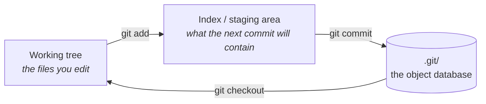

# 2.3 — `git init`, and what a repository actually is

## One-line answer

`git init` creates one hidden folder, `.git/`, which holds a content-addressed database of every
version of every file you ever commit — so a "repository" is not your project folder, it is that
database, and understanding its four object types is what makes every later git command stop being
magic.

---

## The story

An engineer is asked to find out when a particular line of code was introduced, and why. It is a
single condition in a retry loop — `if attempt > 3` — and it is causing a subtle failure.

They ask the team. Nobody remembers. The person who wrote it left a year ago.

So they run `git log` on the file. Two hundred commits. They narrow it with `git blame`, which
annotates every line with the commit that last touched it. The line points at a commit from fourteen
months earlier. They read its message: *"fix flaky test"*. They read its diff: three lines changed,
and the third is the one they are looking at.

Then they read the commit *before* it, and the branch it came from, and the merge that brought it
in. Ten minutes later they have the whole story: the retry cap was added to stop a test flaking, the
test was flaking because of a race condition that was fixed properly two weeks later, and the cap
was never removed. It is not protecting anything. It has been silently capping production retries at
three for over a year.

They delete it, with a commit message explaining all of the above, so that the next person does not
have to repeat the archaeology.

None of that was possible because the team was disciplined. It was possible because git stored every
intermediate state, permanently, along with who made it and what they said about it. **The history
was the tool.** A project without one would have offered exactly one option: guess.

---

## The idea in plain language

`git init` creates a folder called `.git/` in your project directory. Everything git knows lives
inside it. Your project folder minus `.git/` is called the **working tree** — the ordinary files you
edit. Delete `.git/` and you have deleted the entire history while leaving every current file
untouched; copy `.git/` elsewhere and you have copied the whole project's past.

Inside, git stores four kinds of object, and they compose into everything else:

| Object | Is | Holds |
|---|---|---|
| **blob** | file contents | the bytes of one file — no name, no path, no date |
| **tree** | a directory | a list of names → blobs and other trees |
| **commit** | a snapshot | one tree, a parent commit (or two, for a merge), an author, a date, a message |
| **tag** | a name for a commit | usually a release marker |

Every object is stored under the **SHA-1 hash of its own contents**. That single design decision
produces most of git's useful properties:

- **Identical content is stored once.** Two files with the same bytes are the same blob. Committing
  a file that has not changed adds nothing.
- **History is tamper-evident.** A commit's hash covers its tree *and* its parent's hash, so changing
  anything in the past changes every hash after it. You cannot quietly edit a commit from last month
  and leave the chain intact.
- **A commit is a *snapshot*, not a diff.** This surprises people who learned older version-control
  systems. Git stores the complete tree each time and *computes* diffs when you ask for them. That
  is why `git checkout` of an old commit is fast, and why history rewriting is expensive.

**The three places a file can be**, which is the model you actually need day to day:



The middle one — the **index**, also called the staging area — is the piece most people never
properly learn, and it is why `git add` exists as a separate step. It lets you build a commit
deliberately: you changed five files, three of them belong to one logical change, so you stage those
three and commit them alone. A commit is supposed to be a *unit of meaning*, not a timestamp of when
you got tired.

**A branch is not a copy.** It is a movable pointer to one commit — a file in `.git/` containing a
40-character hash. That is why creating a branch is instant regardless of project size, and why the
default branch name (`main`, set in [1.2](../01/1.2-git-bash-and-the-carriage-return.md)) is a
convention rather than anything structural.

**And `HEAD`** is a pointer to the branch you are currently on. "Detached HEAD" — a phrase that
alarms everyone the first time — simply means `HEAD` points straight at a commit rather than at a
branch, which is exactly what happens when you check out an old commit to look around.

---

## Why Mandala needs it

- **Principle 1 is enforced by git.** "Every day produces runnable, committed code. No commit = day
  not done." `./m done N` runs `git commit` and refuses if the checklist has unticked boxes
  ([3.3](../03/3.3-the-done-gate.md)). The commit *is* the completion record — there is no separate
  progress database, on purpose.
- **`docs/TRACKER.md` is generated from what is on disk** ([4.2](../04/4.2-the-tracker-you-never-hand-edit.md)),
  and what is on disk is what git restored. History and progress are the same artifact, so they
  cannot disagree.
- **Day 51 is time travel, forking and replay in LangGraph** — checkpointing a graph so you can go
  back to an earlier state, change one thing, and re-run forward. That is git's model applied to
  agent execution, and the day is much easier if the git version is already intuitive.
- **Day 64 and every gate produce an ADR** — a decision record, committed. The value of an ADR is
  that it sits next to the commit that implemented the decision, so a future reader gets the *why*
  and the *what* together. That is the story at the top of this page, prevented in advance.
- **Day 89 is README-as-portfolio.** A hiring manager reading this repository will look at the
  commit history. Ninety commits with meaningful messages is itself the evidence.

---

## The mechanism

You wrote `.gitignore` in [2.2](2.2-gitignore-before-the-secret-exists.md). Only now:

```bash
git init
```

**Line by line:**

- `git init` — create `.git/` in the current directory and set it up as an empty repository. It
  creates no commit; there is a repository with no history yet, which is a legitimate state.
- It prints the branch name it used. Because you set `init.defaultBranch main` in
  [1.2](../01/1.2-git-bash-and-the-carriage-return.md), that is `main` and there is no advisory
  paragraph.
- **The order matters and is the whole point of doing it here.** `.gitignore` first, `git init`
  second, `.env` on Day 1. At no moment does a secret exist in a directory where git is watching
  without a rule already covering it.

Look at what was created, because it demystifies the rest permanently:

```bash
ls -a && ls .git
```

**Line by line:**

- `ls -a` — list **a**ll entries including hidden ones (names beginning with a dot). Without `-a`
  you will not see `.git`, `.gitignore` or `.env` — which is how people conclude a file "was not
  created" when it is sitting right there.
- `ls .git` — the repository's internals: `objects/` (the four object types), `refs/` (branches and
  tags — the pointers), `HEAD` (which branch you are on), `config` (this repository's settings),
  `hooks/` (scripts git runs at defined moments, which is how the pre-commit hook works).
- Nothing here is magic once you have seen the folder. It is a small database with an unusually good
  data model.

Now make the model concrete. Create a blob by hand and read it back:

```bash
echo "hello mandala" | git hash-object -w --stdin
```

**Line by line:**

- `git hash-object` — compute the hash git *would* store this content under.
- `-w` — actually **w**rite it into the object database rather than only computing the hash.
- `--stdin` — read the content from the pipe instead of from a named file.
- The output is a 40-character hex string: the SHA-1 of the content, and the name the object is now
  stored under. **Nothing about the filename is involved** — this is what "content-addressed" means
  literally.

```bash
git cat-file -p $(echo "hello mandala" | git hash-object --stdin)
```

**Line by line:**

- `git cat-file -p <hash>` — **p**retty-print the object with that hash. Here it prints
  `hello mandala`, proving the round trip.
- `$( ... )` — **command substitution**: run the inner command and paste its output in place. The
  inner `git hash-object --stdin` (without `-w`) just recomputes the same hash, so this reads back
  the object you wrote a moment ago.
- If you ran the same `echo` twice, you got the same hash both times. Two identical files are one
  blob. That is deduplication falling out of the design rather than being implemented.

Confirm the repository is in the state you expect, and that `.env` is still invisible:

```bash
git status
```

**Line by line:**

- `git status` — the single most-typed git command. It reports the branch, whether there are staged
  changes, and which files are untracked.
- On a fresh repository it says "No commits yet" and lists everything as untracked. **Read the
  untracked list carefully now** — it is the last moment before your first commit when checking it
  is cheap, and `.env` must not be on it.

---

## When it breaks

**The identity refusal, on a machine where you skipped [1.2](../01/1.2-git-bash-and-the-carriage-return.md):**

```text
$ git commit -m "day-00: toolchain and skeleton"
Author identity unknown

*** Please tell me who you are.

Run

  git config --global user.email "you@example.com"
  git config --global user.name "Your Name"

to set your account's default identity.
```

**What it means.** Every commit is stamped with an author and git will not invent one. Unusually,
this error tells you the exact fix — run those two commands.

**The one that means you are not where you think you are:**

```text
$ git status
fatal: not a git repository (or any of the parent directories): .git
```

**What it means.** There is no `.git/` here or in any parent directory. Either you have not run
`git init`, or you are in the wrong folder. `pwd` answers the second question in one second, and it
is worth checking before anything else — this error appears far more often from a stray `cd` than
from a missing repository.

**The nested repository, which is confusing out of all proportion to its cause:**

```text
$ git status
On branch main
Changes to be committed:
        new file:   somefolder
```

A whole directory shown as a single "new file". **What it means.** That folder contains its own
`.git/`, so git treats it as a separate repository and records only a pointer to it (a **gitlink**,
the mechanism behind submodules) rather than its contents. Usually it happened because someone ran
`git init` in a subfolder by accident, or cloned a repository inside your project. Remove the inner
`.git/` if it was a mistake — and note that this is one of the few times deleting a `.git/` folder
is the correct move.

**The one that looks alarming and is not:**

```text
$ git checkout a1b2c3d
Note: switching to 'a1b2c3d'.

You are in 'detached HEAD' state. You can look around, make experimental
changes and commit them, and you can discard any commits you make in this
state without impacting any branches by switching back to a branch.
```

**What it means.** `HEAD` points directly at a commit rather than at a branch. Nothing is broken and
nothing is lost — you are standing on a historical snapshot. `git switch -` returns you. The only
real hazard is committing here and then walking away: those commits belong to no branch, and git
will eventually garbage-collect them. `git switch -c <name>` turns them into a branch if you want to
keep them.

---

## In production

**Commit messages are the interface to your own history.** The story at the top of this part turned
on a message saying *"fix flaky test"* — enough to reconstruct intent. A message saying *"fix"*
would have left the engineer guessing. The professional convention is a short imperative subject
line, then a blank line, then a body explaining **why** rather than what (the diff already shows
what). Many teams standardise on Conventional Commits (`feat:`, `fix:`, `docs:`) precisely so the
history is machine-readable enough to generate changelogs and infer version bumps.

**Branch protection turns convention into enforcement.** On a shared repository, `main` is typically
protected: no direct pushes, changes arrive through pull requests, CI must be green, at least one
review is required, and often commits must be signed. **Day 74 wires this project's CI regression
gate**, which is the piece that makes such a rule meaningful — a required check that cannot pass
when the eval suite regresses.

**Git is not a backup and not an artifact store.** It is optimised for text, and it stores every
version of everything forever — which is exactly wrong for large binaries. A 200 MB model checkpoint
committed once makes every future clone download it, permanently, even after deletion. That is why
`.chroma/` and `*.db` are in `.gitignore` ([2.2](2.2-gitignore-before-the-secret-exists.md)), and
why teams reach for Git LFS or an object store when binaries genuinely must be versioned.

**`git bisect` is the payoff nobody mentions until they need it.** Given a commit that was good and
one that is bad, it binary-searches the history, checking out midpoints for you to test. Over a
thousand commits that is ten tests instead of a thousand. It only works if commits are small and
each one is individually runnable — which is the practical argument for atomic commits, stronger
than any tidiness argument. **In this project every day is one commit**, so a regression that
appears on Day 50 can be bisected to the day that introduced it.

**Hooks are where local enforcement lives.** `.git/hooks/` holds scripts git runs at defined moments
— before a commit is created, before a push. This repository's `.pre-commit-config.yaml` manages
that hook: it lints staged files and refuses the commit if they fail. Crucially, hooks are **local
and bypassable** (`git commit --no-verify`), which is why they are a fast first line and never the
last one. CI is the line that cannot be bypassed.

**The review comment a senior engineer leaves.** On a pull request with one enormous commit: *"Can
you split this into logical commits? Right now the refactor and the bug fix are in one change, so we
cannot revert one without the other."* And on a commit message reading *"update"*: *"Please say what
changed and why — in six months this line is the only explanation anyone will have."*

**The interview question.** *"What does a git commit actually contain?"* The weak answer is "my
changes". The one that lands: a commit points at a *tree* — a complete snapshot of the project — plus
one or more parent commits, an author, a timestamp and a message; git stores snapshots and computes
diffs on demand, and every object is addressed by the hash of its content, which is what makes the
history tamper-evident and deduplicated. A good follow-up to volunteer: *"and that is why rewriting
history changes every subsequent hash, which is why you cannot quietly remove a leaked secret from
a repository other people have cloned"* — tying it straight back to
[2.2](2.2-gitignore-before-the-secret-exists.md).

---

## Check yourself

```bash
git status --short && git rev-parse --is-inside-work-tree && ls .git/refs
```

`git status --short` must show untracked files but **no `.env`**. `git rev-parse
--is-inside-work-tree` prints `true`. `ls .git/refs` shows `heads` and `tags` — the two kinds of
pointer, currently empty because you have made no commit yet.

**Answer out loud, without scrolling up:**

> Name the three places a file can be, in order, and the command that moves it between each pair.
> Then: why does committing the same file twice with no changes add nothing to the object database,
> and what property of git's storage makes that true?

---

**Next:** [2.4 — `uv init`, `pyproject.toml`, and the lockfile](2.4-uv-init-pyproject-and-the-lockfile.md)
