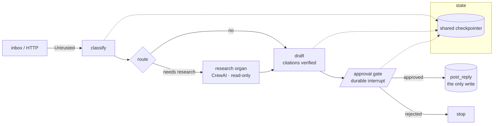

# Day 89 — README-as-portfolio

**Phase 14 · Portfolio & handoff** · IDs: **—** (the plan: *README-as-portfolio, architecture
diagram, demo video, interview Q&A doc built from the ADRs*)

> **Yesterday:** the Phase-13 gate, cold-read this morning. Mandala runs distributed, locally, free.
> **Today:** you write the thing that decides whether any of it counts to anyone else. The Phase-14
> gate is brutal and specific: **a stranger runs Mandala from the README in under 15 minutes.** Not
> "the README is good". A stranger. Fifteen minutes. Timed.
> **Tomorrow:** the retrospective, and the habit that outlives the plan.

```bash
./m start 89
./m scaffold 89
```

---

## §1 The story

You have 88 days of work and a very specific problem: **nobody is going to read it.** A hiring
manager gives a repo ninety seconds. A colleague inheriting it gives it an afternoon. Neither will
open `docs/00_MASTER_PLAN_AGENT_STACKS.md`.

So today has exactly one design constraint, and everything follows from it:

> **The README must pay off in ninety seconds, and still be true after four hours.**

Those pull in opposite directions, which is why most technical READMEs fail one or the other — either
a wall of setup instructions with no idea what the thing *is*, or a beautiful pitch that does not
run. The resolution is ordering, not compression:

| Reader | Gets | In |
|---|---|---|
| the 90-second skimmer | what it is, one diagram, three claims with evidence links | above the fold |
| the 15-minute runner | one command block that works on a clean machine | next |
| the four-hour inheritor | architecture, decisions, honest limits, where the debt is | below |

**And the thing that makes yours unusual is not the agent.** Everyone has an agent. What almost
nobody has: a generated permission table, a red-team suite in CI, a citation verifier, an autonomy
ladder that grants nothing, and five tests that assert the limits of their own controls. **Lead with
those**, because they are the rare part and they are all provable in one command each.

One more framing worth holding: **the README is a claim, and every claim needs a link to evidence.**
"Secure" is worthless. "No agent holds untrusted input and write access —
[`PERMISSION_TABLE.md`](docs/PERMISSION_TABLE.md), asserted by
[`test_no_agent_holds_the_lethal_trifecta`](tests/)" is a different kind of sentence. Do that
everywhere and the document becomes checkable rather than persuasive.

---

## §2 Setup — run this

```bash
mkdir -p days/day-89/lab docs/img
touch README.md
touch docs/ARCHITECTURE.md
touch docs/INTERVIEW_QA.md
touch docs/img/architecture.md          # mermaid source, rendered inline
touch days/day-89/lab/stranger_test.md
touch days/day-89/lab/demo_script.md
touch tests/test_readme.py
```

**Do the stranger test first, before you write a word.** You cannot write setup instructions for a
machine you have configured over ninety days. So:

```bash
cd /tmp && rm -rf mandala-stranger
git clone <your repo> mandala-stranger && cd mandala-stranger
# start a timer. Follow ONLY what is in the current README.
```

Write down every place you had to use knowledge that is not in the repo: a `.env` value, a browser
binary, a Docker image, a Python version, an `uv` install, a `playwright install` step. **That list
is the README's Quick Start**, and it is the only reliable way to produce one.

---

## §3 The README, in order

### 3.1 Above the fold — ninety seconds

```markdown
# Mandala

A support-triage agent built from first principles over 90 days: intake → triage graph →
research → drafted reply with verified citations → **human approval** → external write.
Runs locally on free-tier models. **$0 of paid API spend, start to finish.**


**Three things this repo does that most agent projects don't:**

| Claim | Evidence | Verify it yourself |
|---|---|---|
| No agent holds untrusted input *and* write access | [`PERMISSION_TABLE.md`](docs/PERMISSION_TABLE.md) — generated from code, drift-tested | `uv run pytest tests/test_permission_table_is_current.py` |
| Twenty prompt-injection attacks run on every commit | [`REDTEAM.md`](docs/REDTEAM.md) | `uv run pytest tests/test_redteam.py` |
| Every external write is bound to a human approval of a specific draft hash | [`gate-phase-12.md`](docs/adr/gate-phase-12.md) | `uv run python scripts/audit_writes.py` |

**It is not autonomous, on purpose.** Autonomy is granted per agent, per tool, per condition, with a
written promotion rule — and Mandala currently qualifies for none of it.
[Why](days/day-84/lab/autonomy_review.md).
```

**Line by line:**

- **The one-line description names the pipeline**, not the technology. "Built with LangGraph and
  CrewAI" tells a reader what you used; the pipeline tells them what it does.
- **"$0 of paid API spend" is the hook**, because it is unusual, verifiable and immediately
  interesting. Lead with the constraint that shaped everything.
- The three-claim table has **a verify column**. That is the whole trick: a reader can falsify you in
  one command, which is why they will believe the rest without checking.
- **The "not autonomous, on purpose" paragraph goes above the fold.** Every instinct says to hide it.
  It is the single most senior thing in the repo — a written, evidence-based argument for why you have
  not let the system act alone — and a skimmer who reads only that will think better of you than one
  who reads a feature list.
- Diagram before prose. A reader forms a mental model from the picture and reads the text as
  confirmation.

### 3.2 Quick Start — fifteen minutes, from the stranger test

```markdown
## Quick start

**Requires:** Python 3.12, [uv](https://docs.astral.sh/uv/), Docker (optional, for the
3-replica demo). **No paid API keys.** You need free-tier keys for at least one of
Gemini / Groq / OpenRouter.

    git clone <repo> && cd mandala
    uv sync                                    # ~2 min
    cp .env.example .env                       # then paste ONE free key
    uv run pytest -m eval_unit -q              # ~30s, 0 API calls — proves the install
    uv run python days/day-78/lab/drop_ticket.py T-1001 "printer offline since Tuesday"
    uv run python days/day-79/lab/run_spine.py T-1001
    uv run python days/day-82/lab/approve_cli.py --list

**The first command that costs an API call is the sixth one.** Everything before it —
install, tests, the whole safety suite — runs offline.
```

**Line by line:**

- **An offline verification step before anything needs a key.** A stranger whose install is broken
  finds out in thirty seconds without hunting for credentials. This single ordering decision does
  more for the fifteen-minute target than any amount of prose.
- "paste ONE free key" — not three. **Reduce the required setup to its true minimum** and say what is
  optional.
- Timings on the slow steps. A reader who knows `uv sync` takes two minutes waits; one who does not
  assumes it hung.
- **Everything from the stranger test appears here**, including the ugly bits (`playwright install
  chromium`, the Docker image pull). Put them in an "optional demos" subsection rather than the
  critical path, so the fifteen minutes stays achievable.

### 3.3 Below the fold — the four-hour reader

Sections, in this order, each short:

1. **Architecture** — link to `docs/ARCHITECTURE.md`; three paragraphs here, not thirty.
2. **Why these frameworks** — link to ADR-003 and the Phase-9 scorecard. **You ran a four-framework
   bake-off; almost nobody has.** Two sentences and a link.
3. **Safety model** — the trifecta table, the leash, the approval binding. Link each to its test.
4. **Evals** — three layers, what runs in CI for free, what the judge's kappa actually is.
5. **What I would not deploy** — pulled from the three gate ADRs. **Keep this section.** It is the
   one an experienced reader trusts you for.
6. **Known limits** — the five known-limit tests, listed by name. Nobody does this. Do it.
7. **Cost** — the real numbers from `RATE_BUDGET.md`: requests per ticket, cache hit rate, what the
   whole 90 days consumed.
8. **Repo map** — where things live, in a table.

---

## §4 The architecture diagram



**Line by line:**

- **Mermaid, in the repo, in git.** A PNG exported from a drawing tool is stale within a week and
  unreviewable in a diff. Mermaid renders on GitHub and changes show up as text.
- **The write is visually distinct** (`[( )]`) and there is exactly one of them. A reader should be
  able to point at the dangerous box within two seconds.
- The approval gate is drawn as the **only path** to the write. If your diagram shows another route,
  either the diagram is wrong or your system is.
- The checkpointer subgraph with dotted lines shows *where state lives* without cluttering the flow —
  and it is the thing Phase 13 was about.
- **Label the untrusted edge.** One word (`Untrusted`) on the first arrow tells a knowledgeable reader
  more about your design than a paragraph would.

---

## §5 The interview Q&A doc

`docs/INTERVIEW_QA.md`, built from the ADRs — this is for you, not for a reader.

**Do not write new content.** Every one of your lessons ended with a §"Say it in an interview"
paragraph. Collect them, group them, and cut them down. Suggested groups:

| Group | Drawn from |
|---|---|
| Agent fundamentals: loops, tools, memory, context | Days 3–8 |
| Framework comparison: who owns the loop | Days 9–52, ADR-003, the scorecard |
| Safety: trifecta, injection, sandboxing, computer use | Days 65–70 |
| Evals: three layers, judge calibration, CI gates | Days 71–77 |
| Production: durability, statelessness, interop | Days 79–88 |
| **The honest ones: what you would not deploy, and why** | the four gate ADRs |

**Line by line:**

- **Rehearse the last group most.** "What are the limits of what you built?" is the question that
  separates candidates, and you have four gate ADRs' worth of specific, evidenced answers where most
  people have a shrug.
- Keep each answer to **~60 seconds spoken**, roughly 150 words. Anything longer will be interrupted.
- For each answer, note the **one artifact you would show** if someone said "show me". An answer with
  a file path behind it is a different class of answer.

### 5.1 The demo script

`days/day-89/lab/demo_script.md` — a three-minute recording, shot list only:

1. **0:00–0:20** — one ticket in, the graph drawn, the run stopping at the approval gate.
2. **0:20–1:00** — the approval CLI in a *different terminal*; the write appearing in `outbox/`;
   `audit_writes.py` proving it was approved.
3. **1:00–1:40** — the hostile ticket: injection attempted, control fires, nothing written.
4. **1:40–2:20** — `any_replica_test.py`: one answer, three replicas.
5. **2:20–3:00** — `pytest -m eval_unit` and the red-team suite, green, zero API calls.

**Show the safety, not the happy path.** The happy path is a demo; the refusal is the product.

---

## §6 The eval that must be able to fail

```python
# tests/test_readme.py
import pathlib
import re

import pytest

pytestmark = pytest.mark.eval_unit
README = pathlib.Path("README.md").read_text(encoding="utf-8")


def test_every_internal_link_resolves():
    """Flip it: skip this and your portfolio ships with three broken links."""
    for target in re.findall(r"\]\((?!https?://)([^)#]+)", README):
        assert pathlib.Path(target.strip()).exists(), f"broken link: {target}"


def test_every_claim_in_the_table_has_a_verify_command():
    table = README.split("Three things this repo")[1].split("\n\n")[0]
    rows = [r for r in table.splitlines() if r.startswith("|") and "---" not in r][1:]
    for row in rows:
        assert "uv run" in row, f"claim with no verify command: {row[:60]}"


def test_the_quick_start_runs_something_offline_before_any_key_is_needed():
    qs = README.split("## Quick start")[1]
    assert qs.index("pytest -m eval_unit") < qs.index("run_spine"), "key-free proof must come first"


def test_the_readme_states_what_is_not_deployed():
    assert "not autonomous" in README.lower() or "would not deploy" in README.lower()


def test_the_readme_does_not_claim_autonomy_it_does_not_have():
    from mandala.autonomy.ladder import GRANTS

    if GRANTS == ():
        assert "fully autonomous" not in README.lower()
        assert "auto-closes" not in README.lower()


def test_no_secrets_in_the_readme():
    for pattern in (r"sk-[A-Za-z0-9]{10,}", r"gsk_[A-Za-z0-9]{10,}", r"AIza[A-Za-z0-9]{10,}"):
        assert not re.search(pattern, README)


def test_dev_only_items_are_not_presented_as_features():
    """The Day-88 gate listed them. They must not appear in the README as design."""
    for hack in ("x-replica", "DEV ONLY", "localtest"):
        assert hack not in README


def test_the_architecture_diagram_is_in_git_not_a_binary():
    assert pathlib.Path("docs/img/architecture.md").exists()


def test_the_diagram_shows_exactly_one_write():
    mermaid = pathlib.Path("docs/img/architecture.md").read_text(encoding="utf-8")
    assert mermaid.count("post_reply") == 1


def test_the_interview_doc_covers_every_phase_gate():
    qa = pathlib.Path("docs/INTERVIEW_QA.md").read_text(encoding="utf-8")
    for phase in ("10", "11", "12", "13"):
        assert f"phase-{phase}" in qa.lower() or f"Phase {phase}" in qa
```

**Line by line:**

- `test_every_internal_link_resolves` is the day's headline for an unglamorous reason: **a portfolio
  README with a broken link is the cheapest possible way to look careless**, and it happens to
  everyone who renames a file after writing the README.
- `test_the_readme_does_not_claim_autonomy_it_does_not_have` couples marketing to code. If you ever
  do grant level 2, the test relaxes automatically; until then it prevents an overstatement.
- `test_dev_only_items_are_not_presented_as_features` closes the loop from yesterday's gate list.
- `test_the_quick_start_runs_something_offline_before_any_key_is_needed` enforces the ordering
  decision that actually delivers the fifteen minutes.

---

## §7 Traps

- **Writing the README before the stranger test.** You cannot un-know your own setup.
- **Setup before "what is this".** Ninety seconds, wasted.
- **Claims without verify commands.** Unfalsifiable is unpersuasive.
- **Hiding the not-autonomous decision.** It is your best material.
- **Leading with the framework list.** Everyone has one.
- **A binary diagram.** Stale in a week, unreviewable forever.
- **A diagram with two paths to the write.** Fix the diagram or the system.
- **A README that overstates what the code does.** Test it.
- **DEV ONLY hacks presented as design.**
- **Broken internal links.**
- **A demo video of the happy path.** The refusal is the product.
- **Writing new interview answers** instead of harvesting eighty-eight existing ones.
- **Optional steps on the critical path.** Docker and Playwright go in "optional demos".

---

## §8 Request budget

**Declared: ~10 model requests — for the demo recording only.**

| What | Requests |
|---|---|
| Stranger test (offline path) | **0** |
| All README tests | **0** |
| Demo recording, two or three takes | ≤ 10 |

**Record the stranger-test time in `RATE_BUDGET.md` too** — not requests, minutes. It is the Phase-14
gate criterion, it is the only number that matters tomorrow, and having it written down means Day 90
opens with evidence rather than a guess.

---

## §9 Verify before you code

Written **2026-08-21**:

- **Does GitHub render your Mermaid** in a fenced ` ```mermaid ` block inside a `.md` file, and does
  it render when *embedded* in README? Check both; the answer differs by context.
- **`uv sync` on a clean machine with no cache** — time it for real. Your cached two minutes may be
  someone else's eight.
- **Does `.env.example` have every variable** the quick start needs, and only those? Diff it against
  your actual `.env` keys (names only, never values).
- **Does the repo work on a case-sensitive filesystem?** You develop on Windows; a stranger may be on
  Linux. `git ls-files | sort -f | uniq -di` finds case collisions.
- **Is `uv.lock` committed?** Without it, `uv sync --frozen` fails for a stranger.
- **Screen-recording tool** that produces a file under 25 MB, or the demo is unwatchable in a PR.

---

## §10 Say it in an interview

> "The README is the artifact I put the most thought into, because a repo gets ninety seconds from a
> hiring manager and an afternoon from someone inheriting it, and those are different documents in
> the same file. So it's ordered: what it is and one diagram, then three claims each with a link to
> evidence *and* a command you can run to falsify me, then a quick start where the first six commands
> need no API key at all — so a stranger with a broken install finds out in thirty seconds rather than
> hunting for credentials. I wrote it after doing a timed stranger test: fresh clone into /tmp,
> follow only what's written, and note every place I used knowledge that wasn't in the repo. That's
> the only reliable way to write setup instructions for a machine you've been configuring for three
> months. The section I'd point at is 'what I would not deploy' — it's above the fold, it says the
> system is deliberately not autonomous and links to the written promotion rule it doesn't yet meet,
> and every instinct says to hide that. I think it's the most senior thing in the repo. And there are
> tests on the README itself: internal links resolve, no claim appears without a verify command, and
> if my autonomy ladder is empty then the word 'autonomous' can't appear as a feature — so the
> marketing can't drift from the code."

---

## §11 Done when

```bash
./m check
./m done 89
```
